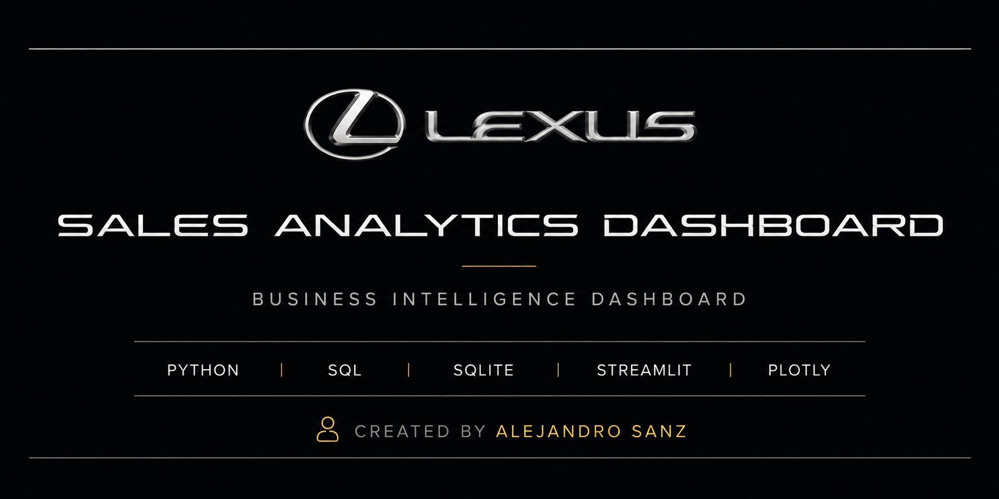

# Lexus Sales Analytics Dashboard

An end-to-end **Business Intelligence** dashboard built with **Python, SQLite, SQL, Streamlit, Plotly, and Pandas**.

The application transforms monthly dealership sales reports into a centralized SQLite database, performs advanced SQL analytics, and presents interactive dashboards for executive decision-making.

---

# Dashboard Preview

## Executive Dashboard

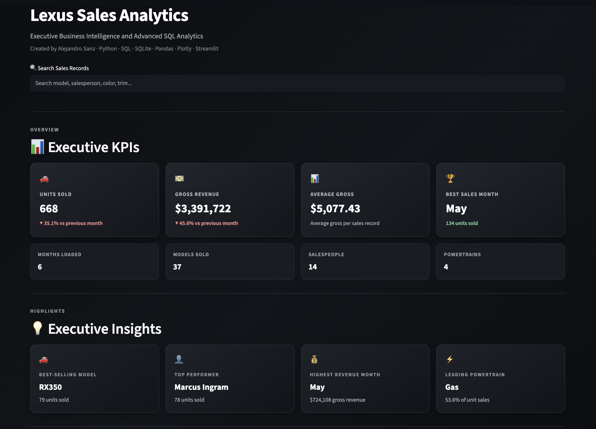

---

## Performance Leaders

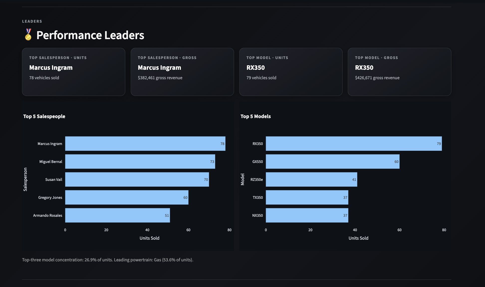
---

## Model Detail Dashboard

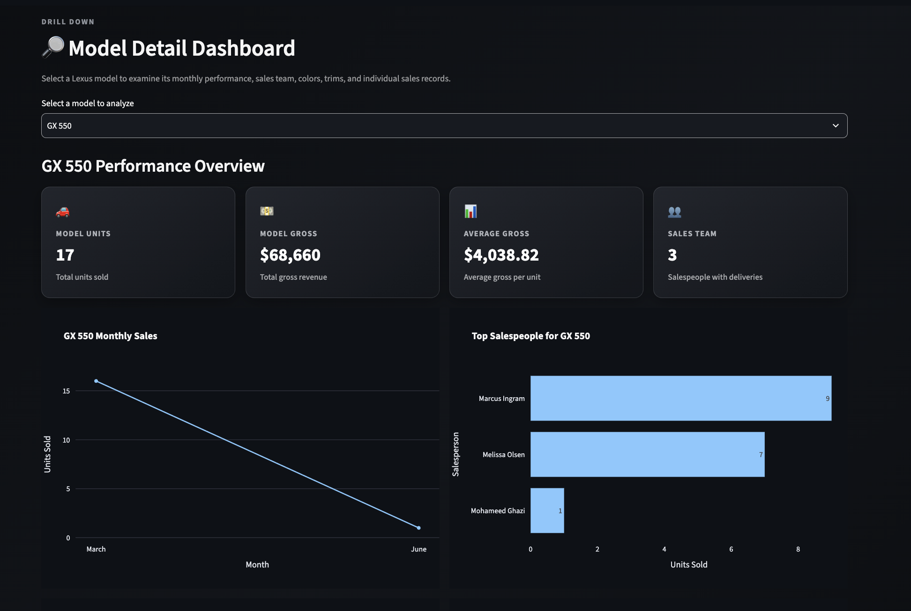
---

## Monthly Performance

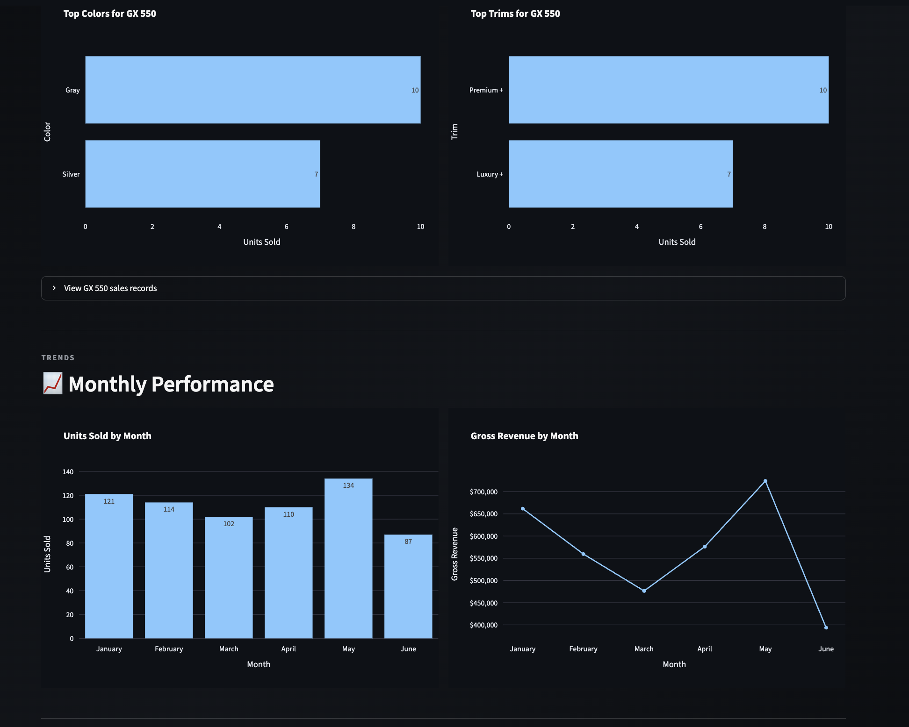
---

## Sales Breakdown

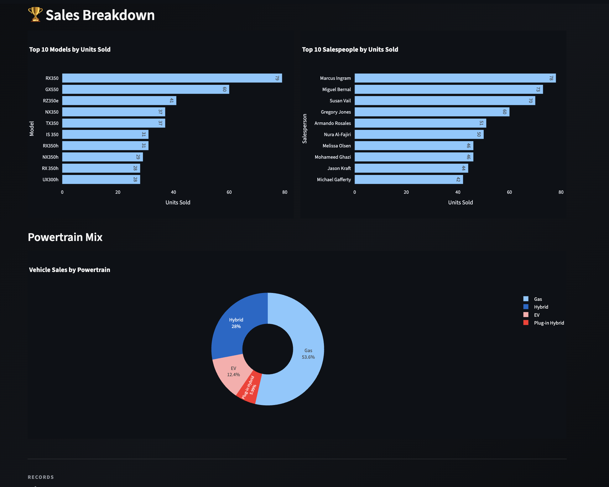

---

## Sales Explorer

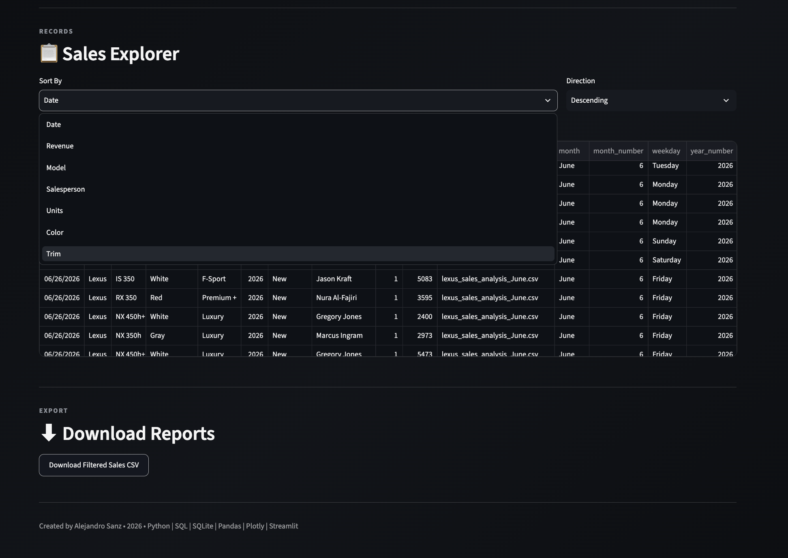

---

## Interactive Filters

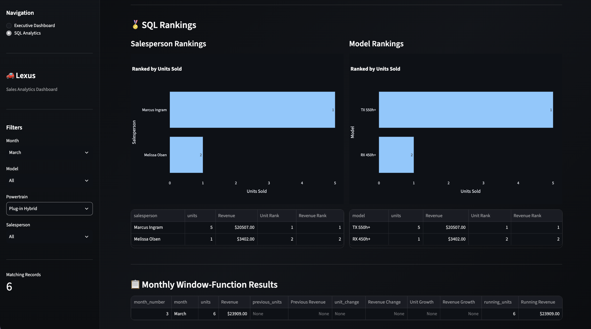

---

## SQL Analytics Overview

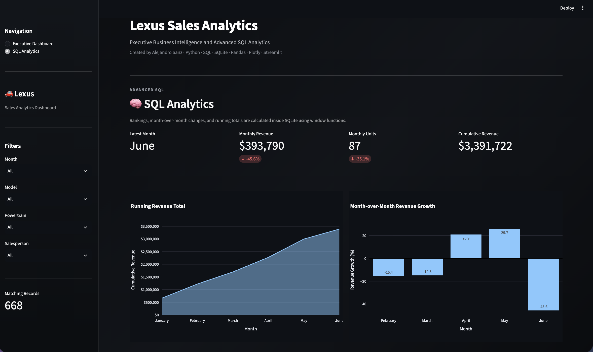

---

## SQL Rankings

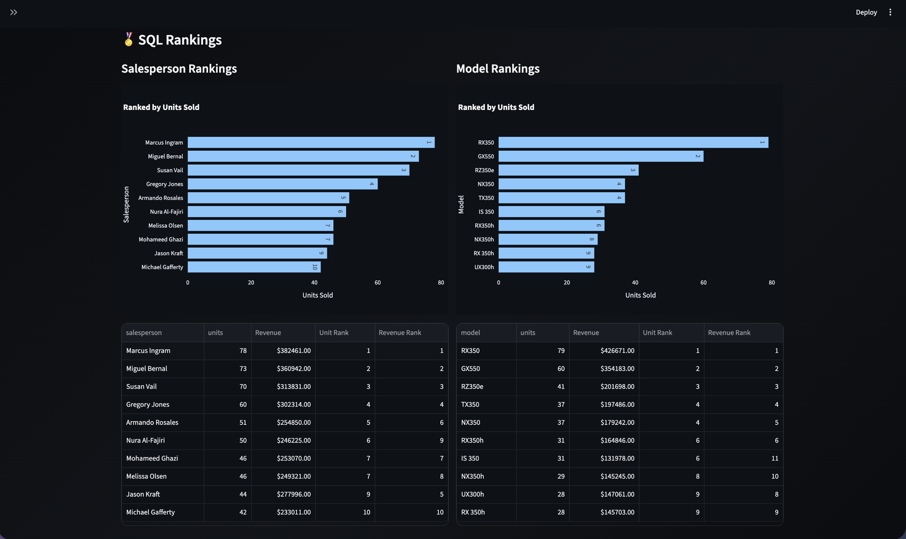

---

## Window Functions & Database Indexes

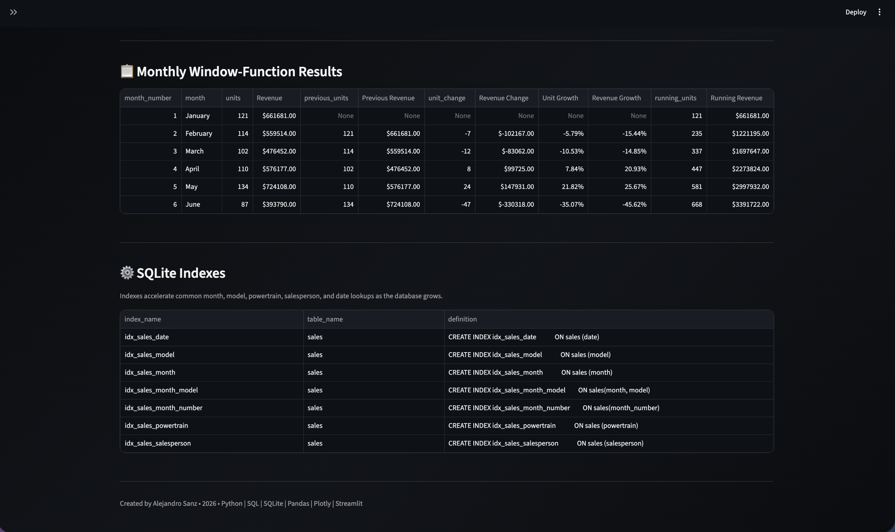

---

# 📖 Overview

This project simulates a real-world Business Intelligence solution for an automotive dealership.

Monthly Lexus sales reports are:

- Cleaned and transformed using Pandas
- Loaded into a centralized SQLite database
- Queried using advanced SQL
- Visualized through an interactive Streamlit dashboard

The application demonstrates the complete analytics workflow—from raw CSV files to executive-level reporting.

---

# 📌 Key Highlights

- End-to-end Business Intelligence workflow
- Interactive executive dashboard
- SQL-powered analytics
- Dynamic dashboard filtering
- Advanced SQL window functions
- Database indexing for performance
- Executive KPI reporting
- Model drill-down analytics
- Interactive sales explorer
- Exportable sales reports

---

# Dashboard Features

## 📊 Executive Dashboard

- Executive KPI cards
- Revenue and unit tracking
- Executive insights
- Performance leaderboards
- Monthly sales trends
- Model Detail Dashboard
- Sales breakdown visualizations
- Interactive Sales Explorer
- CSV report export

---

## 📊 SQL Analytics

Advanced analytics are calculated directly inside SQLite using SQL.

Features include:

- WHERE filtering
- GROUP BY aggregations
- RANK() window functions
- LAG() month-over-month comparisons
- Running revenue totals
- Revenue growth analysis
- Database indexes
- Interactive SQL analytics page

---

# 🏗 Project Architecture

```text
Monthly CSV Files
        │
        ▼
Data Cleaning (Pandas)
        │
        ▼
SQLite Database
        │
        ▼
Parameterized SQL Queries
        │
        ▼
Pandas DataFrames
        │
        ▼
Plotly Visualizations
        │
        ▼
Streamlit Dashboard
```

---

# 🗄 Database Design

The dashboard stores dealership sales in a centralized SQLite database.

Key fields include:

- Date
- Month
- Model
- Powertrain
- Salesperson
- Units Sold
- Gross Revenue

Frequently queried columns are indexed to improve query performance.

---

# 💻 SQL Showcase

### Salesperson Ranking

```sql
SELECT
    salesperson,
    SUM(units) AS units,
    RANK() OVER (
        ORDER BY SUM(units) DESC
    ) AS unit_rank
FROM sales
GROUP BY salesperson;
```

### Month-over-Month Revenue

```sql
SELECT
    revenue,
    LAG(revenue)
        OVER (ORDER BY month_number)
FROM monthly_sales;
```

### Running Revenue Total

```sql
SUM(revenue)
OVER (
    ORDER BY month_number
    ROWS BETWEEN UNBOUNDED PRECEDING
    AND CURRENT ROW
)
```

---

# 💾 Technology Stack

| Category | Technology |
|----------|------------|
| Programming | Python |
| Database | SQLite |
| Query Language | SQL |
| Data Processing | Pandas |
| Dashboard | Streamlit |
| Visualization | Plotly |
| Version Control | Git & GitHub |

---

# 📁 Project Structure

```text
lexus-sales-analytics-dashboard/
│
├── app.py
├── create_database.py
├── lexus_sales.db
├── requirements.txt
├── README.md
│
├── modules/
│   ├── database.py
│   └── data_loader.py
│
├── images/
│
└── Sales By Month/
```

---

# 🗄 Running Locally

```bash
git clone <repository-url>

cd lexus-sales-analytics-dashboard

python -m venv venv

source venv/bin/activate

pip install -r requirements.txt

python create_database.py

python -m streamlit run app.py
```

---

# ✅ Skills Demonstrated

- Python application development
- Modular software architecture
- SQLite database design
- SQL querying
- SQL Window Functions
- Database indexing
- Data cleaning with Pandas
- Business Intelligence
- Interactive dashboard development
- Data visualization with Plotly
- Executive reporting
- ETL workflow design

---

# 🗂 What I Learned

Through this project I strengthened my understanding of:

- Designing end-to-end analytics pipelines
- Building maintainable Python applications
- Writing efficient SQL queries
- Using SQL window functions for business reporting
- Creating executive dashboards for non-technical users
- Optimizing database performance with indexes
- Transforming raw data into actionable insights

---

# 📝 Future Improvements

- PostgreSQL migration
- Cloud deployment
- Automated ETL pipeline
- Sales forecasting
- Inventory optimization
- User authentication
- Scheduled report generation
- Role-based dashboard access

---

# ℹ️ Author

## Alejandro Sanz

Mathematics student at **California State University San Marcos** interested in:

- Data Analytics
- Business Intelligence
- Software Engineering
- Applied Mathematics
- Machine Learning

Feel free to connect or explore my other projects on GitHub.

---
## Disclaimer

This project was developed as a personal portfolio application for educational and demonstration purposes.

The dataset is fictionalized and does **not** represent the actual sales performance, revenue, employees, customers, or internal business data of any Lexus dealership. While inspired by real-world automotive sales workflows and market trends, all data has been anonymized or generated for demonstration purposes only.

📍 If you found this project interesting, consider giving the repository a star!